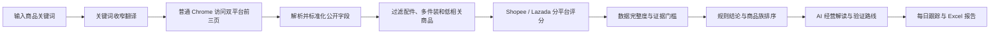

# MY Market Radar 系统逻辑说明（合伙人版）

> 版本：2026-08-24  
> 适用市场：Shopee Malaysia、Lazada Malaysia  
> 目的：说明系统如何取得数据、如何形成结论、AI 参与到哪里，以及这些结论应该怎样用于选品决策。

## 1. 一句话说明

MY Market Radar 是一套“公开市场证据整理器”。用户输入一个商品关键词，系统会在已登录的普通 Google Chrome 中读取 Shopee Malaysia 和 Lazada Malaysia 的公开搜索结果，过滤无关商品，分别计算两个平台的市场信号，再由 AI 把这些证据整理成可执行的验证路线。

它帮助我们回答：

- 搜索结果里是否存在足够多的同类商品？
- 当前公开需求信号、竞争门槛和价格空间分别怎样？
- 哪些细分商品族更值得优先核验？
- 下一步应该收集什么业务证据，才能决定是否测试或放弃？

它不会直接回答“这个商品一定赚钱”，也不会把公开已售数当成真实月销量。

## 2. 系统流程

系统刻意把“事实处理”“规则评分”和“AI 解读”分开。这样即使 AI 服务不可用，采集、分数、证据等级和规则结论仍然可以独立完成。

## 3. 数据从哪里来

### 3.1 浏览器与登录态

正式环境不使用 Playwright，也不启动一个新的无登录浏览器。Browser Bridge 扩展复用用户平时使用、已经登录平台的普通 Google Chrome。

每个平台会锁定一个真实标签页，在同一标签页中依次访问搜索结果第 1、2、3 页。默认每页最多保存 20 条有效商品，因此单个平台最多保存 60 条，双平台最多 120 条。

每一页都会依次确认：

1. URL 和目标页码正确；
2. 页面已经切换到新的文档；
3. 商品网格已出现；
4. 滚动后的结果数量趋于稳定。

如果平台出现验证码或安全验证，任务会暂停并锁定本次实际卡住的标签页。用户手动完成验证后点击继续。系统不会绕过验证码，也不会伪造浏览器指纹。

### 3.2 采集的公开字段

系统尽量保存以下公开字段：

- 商品标题、图片和链接；
- 当前价格、原价和折扣；
- 页面公开显示的已售数；
- 评分和评论数；
- 店铺、地区和可识别的卖家身份；
- 广告标记；
- 平台搜索位次、页码和页内位置；
- 采集时间及必要的原始解析证据。

Shopee 与 Lazada 的公开字段并不完全一致。例如 Shopee 搜索卡可能有评分但没有评论数，Lazada 可能有评论数但没有可可靠读取的评分。缺失字段保持为空，不会填成 0。

## 4. 数据怎样变成可比较样本

原始搜索结果不能直接拿来评分。系统先做四类处理：

### 4.1 关键词本地化

中文关键词会被收窄为马来西亚站适用的英文搜索词，并补充严格同义的英文、马来文或中文别名。例如“毛巾”对应 `towel / towels / tuala`。

已有确定性词表时优先使用词表；未知关键词才调用 AI 翻译。AI 被要求只给同一种商品的严格同义词，不能擅自加入人群、尺寸、配件或相邻品类。翻译结果会缓存，保证后续运行口径稳定。

### 4.2 去重与字段补全

跨滚动、跨页面遇到同一商品时，系统按商品 ID、店铺 ID和规范链接去重。第一次出现的位置作为搜索位次；后续出现的更完整字段可以补到同一商品上。

### 4.3 排除不可比商品

以下结果不进入核心机会评分：

- 配件、替换件或保护套；
- 明显的组合装、多件装；
- 与目标商品低相关的搜索漂移；
- 缺少基本商品身份、无法可靠解析的卡片。

排除数量会按 `accessory / bundle / low_relevance` 单独显示，避免系统通过隐藏脏数据来“做高分”。

### 4.4 平台口径隔离

Shopee 和 Lazada 先各自计算，公开已售数不跨平台直接相加或比较。两个平台都达到证据门槛时，才按各自数据完整度合成综合分。

## 5. 机会分怎样计算

机会分是 0–100 的公开数据启发式指标：

| 维度 | 权重 | 主要证据 | 含义 |
|---|---:|---|---|
| 需求信号 | 40% | 公开已售、评论及其字段覆盖 | 同类商品是否存在可见的市场活动 |
| 进入可行性 | 35% | 评论门槛、强势商品、广告压力、卖家集中度 | 新商品面对的公开竞争障碍 |
| 价格空间 | 25% | 有效商品价格分布和离散程度 | 是否存在可测试的价格带，而非只剩单一低价竞争 |

缺失证据不会让其他字段自动放大。系统会把缺失部分向中性分收缩，并降低完整度。

### 5.1 平台评分资格

平台至少需要满足这些基本条件，才允许形成正式平台分：

- 至少 10 条相关商品；
- 价格覆盖不低于 50%；
- 销量或评论形成足够的需求证据；
- 核心评分证据可靠度达到门槛；
- 总体数据完整度不低于 55%。

不满足时显示“数据不足”，而不是为了给出结论而降低门槛。

### 5.2 结论区间

- 70 分及以上：建议尝试；
- 45–69.9 分：谨慎观察；
- 低于 45 分：暂不建议；
- 未达到证据门槛：数据不足。

这只是市场验证优先级，不是利润率或成功概率。

## 6. Evidence A/B/C/D 是什么

Evidence 等级表示“这次分析有多值得信任”，与机会分不是同一个概念。

- **A · 高可信**：双平台达到评分资格，样本、完整度和采集健康度都较好；
- **B · 可参考**：核心证据可用，但仍存在部分字段或样本限制；
- **C · 弱证据**：只能作为候选线索，不宜直接推进；
- **D · 证据不足**：至少一个关键环节不满足要求，应先补采或修复口径。

正确阅读顺序是：先看采集健康度和 Evidence，再看机会分，最后看 AI 建议。

## 7. 商品族机会排序

系统会从相关商品标题中提取反复出现的属性词，例如材质、人群、使用场景或形态，并形成轻量商品族。

商品族会单独计算：

- 机会分；
- 样本量和占比；
- 双平台覆盖；
- 中位价格；
- 排名可靠度；
- 有证据时的卖家集中度。

小样本、单平台或字段不完整的商品族会向中性分收缩。商品族不是平台官方类目，只用于缩小下一步人工验证范围。

## 8. AI 具体参与什么

当前模型为 `gpt-5.6-sol`，通过 OpenAI-compatible 服务端接口调用。AI 有三项职责：

### 8.1 收窄翻译关键词

未知中文或混合语言关键词会被转换成适合马来西亚站搜索的严格商品短语，并生成同义词供相关性过滤使用。

### 8.2 解释规则证据

规则评分完成后，AI 只读取压缩后的聚合公开数据，包括：

- 最终规则分、结论和 Evidence；
- 各平台分数、样本、字段覆盖和证据缺口；
- 价格、公开已售、评论、评分、广告和卖家集中度摘要；
- 被排除商品数量；
- 排名靠前的商品族；
- 规则引擎已经识别出的风险提示。

AI 不会收到浏览器 Cookie、平台密码或私有店铺后台数据。

### 8.3 生成“下一步验证路线”

AI 会根据本轮实际证据生成 3 个分阶段步骤。每一步包含：

- 当前阶段；
- 要解决的业务问题；
- 为什么现在应该做；
- 具体执行动作；
- 复盘时必须记录的证据。

AI 不能凭空给出预算、MOQ、时间周期、销量目标或利润承诺。系统会校验 AI 输出中的数字：如果某个数字没有出现在输入证据中，整段 AI 分析会被拒绝，不会展示为有效建议。

### 8.4 AI 故障保护

超时、连接失败、HTTP 429 或服务端 5xx 会自动重试，初次请求后最多重试 5 次。每次重试都会更新任务心跳和界面状态。鉴权错误等非临时问题不会盲目重试。

即使 AI 最终不可用，规则评分与报告仍然有效；界面会明确显示 AI 暂不可用，而不是伪造内容。

## 9. 每日跟踪与趋势证据

启用跟踪的关键词默认每天 20:00（马来西亚时区）运行一次。应用当天未运行时，下次启动只补跑当天一次，不追赶全部历史任务。

有两次以上稳定快照后，系统才计算近期趋势：

- 同一商品的价格变化；
- 公开已售与评论增量；
- 搜索排名变化；
- 有活动商品占比；
- 趋势匹配率和可靠度。

近期趋势目前是辅助证据，不会直接改写主机会分。这样可以区分“历史累计卖得多”和“最近仍在增长”。

## 10. 怎样用于真实选品决策

推荐的决策顺序：

1. **看采集健康度**：确认两边页面都真正采到目标数量；
2. **看 Evidence**：判断这次结果能否作为决策依据；
3. **看平台差异**：分别理解 Shopee 和 Lazada，不混用销量口径；
4. **看商品族**：选择可供应、可区分且证据更可靠的细分方向；
5. **执行 AI 验证路线**：核对商品、供应链、规格、成本和真实运营数据；
6. **建立真实经济模型**：人工录入采购、物流、平台费、广告、退货和税费；
7. **复扫并看趋势**：确认公开市场信号是否持续，再决定扩大、继续观察或停止。

### 示例：毛巾

2026-08-24 的一次稳定扫描中：

- Shopee 保存 60 条，57 条进入评分；
- Lazada 保存 60 条，54 条进入评分；
- 综合机会分 66.5，结论“谨慎观察”；
- 数据完整度 85.6%，Evidence A。

这说明数据足够支持进一步验证，但 66.5 并不等于“赚钱概率 66.5%”。正确动作是根据商品族和平台差异进一步核算，而不是直接下单。

## 11. 数据与安全边界

- 业务数据保存在本地 SQLite；
- AI 密钥只存在服务端环境变量，不写入前端和 Git；
- AI 请求设置 `store=false`；
- AI 只读取聚合后的公开字段；
- 浏览器登录态留在用户 Chrome 内；
- 验证码只允许人工处理；
- 每次分析保留实际搜索词、采集页码、平台错误和证据口径，便于复查；
- Excel 对可能触发公式执行的文本进行安全处理。

## 12. 当前系统不能证明什么

仅凭公开搜索结果，系统不能证明：

- 真实 GMV、真实月销量或店铺后台转化率；
- 广告实际花费；
- 采购、物流、退货、税费和净利润；
- 平台完整市场份额；
- 某个商品未来一定增长；
- 某个平台公开已售口径可以与另一个平台直接比较。

因此，系统的最佳用途是提高“先验证什么”的效率，而不是替代供应链、财务和实际投放测试。

## 13. 合伙人快速检查清单

在决定推进一个商品前，至少确认：

- [ ] Shopee 与 Lazada 是否都达到平台评分资格；
- [ ] Evidence 是否为 A 或 B；
- [ ] 被排除的配件、多件装和低相关商品是否合理；
- [ ] 目标商品族是否有足够样本和双平台证据；
- [ ] AI 建议是否明确引用本轮证据，而非通用话术；
- [ ] 采购、物流、平台费、广告、退货和税费是否已人工核算；
- [ ] 是否已有第二次稳定扫描用于观察近期趋势；
- [ ] 最终推进决定是否记录了理由和停止条件。

---

详细技术说明可继续参考：

- `docs/BROWSER_TABS.md`：普通 Chrome、标签页锁定与人工验证；
- `docs/TEMPORAL_EVIDENCE.md`：跨快照近期趋势；
- `docs/WORKER_RECOVERY.md`：任务心跳与恢复；
- `docs/REPORT_SECURITY.md`：Excel 输出安全。
